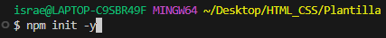
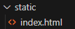
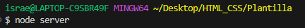
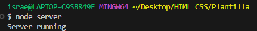
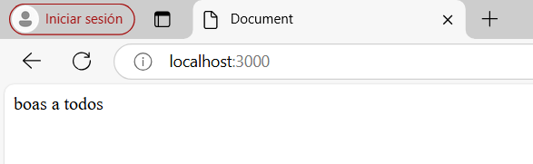

# Antes de comenzar

Iniciaremos cada proxecto ou exercicio dende unha carpeta valeira, onde deberemos inicializala mediante o seguinte comando:

```bash
npm init -y
```

Como aparece na seguinte imaxe:




## Instalando paquetes de npm

> Para poder inicialo servidor, mais poder realizar dunha maneira axeitada o exercicio da aplicación, deberemos ter instalados varios paquetes, entre eles:
>
>  - express

Neste sentido, deberemos instalalos dende a consola.

NPM é un xestor de paquetes creado en javascript, en NODE ven instalado por defecto, as súas siglas significan Node Package Manager (Manexador de paquetes de Node).

O uso principal de NPM é descargar paquetes.

> ### Qué é un paquete

```
É un pedazo de código que pode ser copiado e instalado
```
Veñen na carpeta chamada "node_modules". Nesta plataforma non aparecen pero están, é dicir, a carpeta está oculta.

No caso de instalar Node nun IDE, esta aparecerá o instalar algún.

> ### Instalación de Express

A instalación de Express, realizarémola escribindo o seguinte comando:

```
npm i express
```

> ### O arquivo: 'package.json'

Antes de instalar nada, se observásemos o arquivo, visualizaríamos o seguinte:

```json
{
  "name": "html_css",
  "version": "1.0.0",
  "main": "index.js",
  "scripts": {
    "test": "echo \"Error: no test specified\" && exit 1"
  },
  "keywords": [],
  "author": "",
  "license": "ISC",
  "description": "",
}
```

Despois da instalación dos paquetes, visualizaremos o arquivo ***package.json*** comprobando que estes foron instalados.

Neste caso, dádevos conta que se modificou con varios elementos, un denominado "devDependencies", onde se observa que foi instalado o _body-parser_ e mais _cors_, e o outro co elemento denominado "dependencies" onde está instalado _express_.


```json
{
  "name": "html_css",
  "version": "1.0.0",
  "main": "index.js",
  "scripts": {
    "test": "echo \"Error: no test specified\" && exit 1"
  },
  "keywords": [],
  "author": "",
  "license": "ISC",
  "description": "",
  "dependencies": {
    "express": "^4.21.1"
  }
}
```

## Os programas

> Para poder realizalas aplicacións, estas deberán conter coma mínimo, varios arquivos.
>
> Entre eles un que se vai chamar __server.js__ co seguinte código (dada a instalacións destes paquetes)

```javascript
const express = require("express");
const path = require("path");
const app = express();


// Accedo o arquivo estático
app.use(express.static(path.join(__dirname, "static")));

//START SERVER
app.listen(3000, function () {
 console.log("Server running");
});
```

> ### A carpeta 'static' e o arquivo 'index.html'

Deberemos crear unha carpeta chamada __static__ e sobre a mesma crearemos un arquivo chamado __index.html__, de tal xeito que visualizaremos o seguinte:



#### O arquivo 'index.html'

Vamos crear o seguinte contido:

```html
<!DOCTYPE html>
<html lang="en">
<head>
    <meta charset="UTF-8">
    <meta name="viewport" content="width=device-width, initial-scale=1.0">
    <title>Document</title>
</head>
<body>
    boas a todos
</body>
</html>
```

## Lanzando a aplicación

Unha vez creado todo o anterior, deberemos escribir sobre o shell o seguinte:

```
node server
```
ou 

```
node server.js
```
O primeiro paso sería escribir sobre a línea de comandos: 




Unha vez escrito, executamos, visualizando o seguinte:




E comprobaremos efectivamente que sae :


