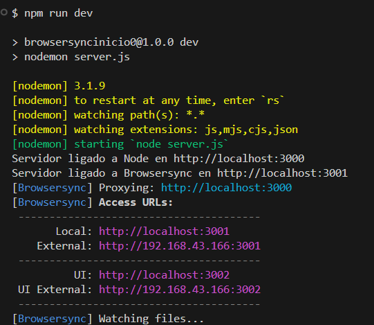

# Notas 

Esta plantilla está a usar `Browsersync` e `nodemon`. Observámolo no `package.json`:

```json
"devDependencies": {
    "browser-sync": "^3.0.3",
    "nodemon": "^3.1.9"
  }
```

Se clonamos este repositorio, deberemos inicializalo mediante o comando :

```bash
npm i
```
Así, instalaranse os paquetes usados.

## 

> [!NOTE]  
> Non vamos entrar na configuración ou funcionamento deste, se queres máis información :


[Link a web](!https://browsersync.io/)


> O uso deste, fai que os cambios no `Front` sexan reflexados instantáneamente no navegador.
Para poder observar isto, deberémos darnos conta que temos integrado no `server.js`, a través das seguintes liñas :

```javascript
const browserSync = require('browser-sync').create();

// Configurar BrowserSync
browserSync.init({
    proxy: `http://localhost:${port}`,    // Usar o servidor Express
    files: ['./public/**/*.*'],           // Monitorear cambios nos arquivos estáticos
    open: false,                          // Evítase abrir unha nova pestaña
});
```

## Nodemon

> Este paquete fará que os cambios que vai facendo no arquivo `server.js`, serán actualizados de maneira automática.

Se queres profundizar sobre este, te deixo o seguinte link:

[Link a nodemon](!https://nodemon.io/)

## Executando na consola

> [!NOTE] 
> Non vamos entrar na configuración de comandos, simplemente, deberemos executar o comando:

```bash
npm run dev
```

Deste xeito, executaremos ditos paquete instalados. Veremos o seguinte:

